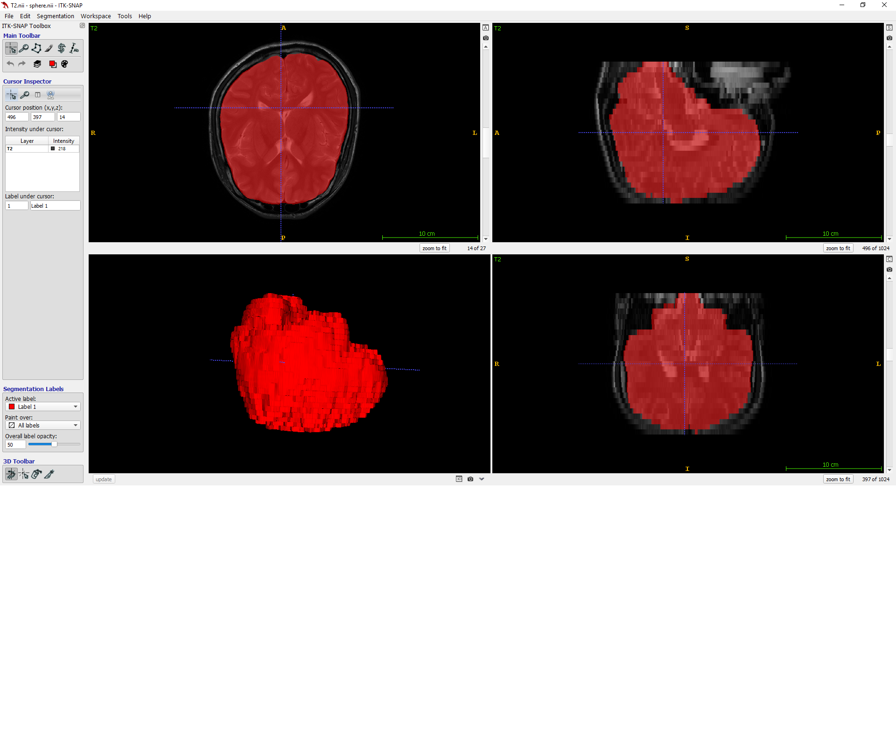

# vtkBrainExtractionFilter

This filter is a vtk Implementation of FSL Brain Extraction Tool. Most of the algorithm is exactly the same as the source code in FSL. But the algorithm is now re-written in vtk without using the FSL data type.  
Now the [vtk library](https://www.vtk.org/)is the only dependency.  
The original paper of the algorithm <q>[Fast robust automated brain extraction](README/SEG_BET_Fast\ robust\ automated\ brain_Smith_HBM2002.pdf)</q>

Samples:  
 
